# Design Document
## Domain Model
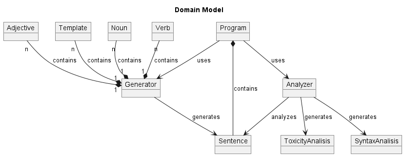
## System Sequence Diagrams
### Sentence Analysis
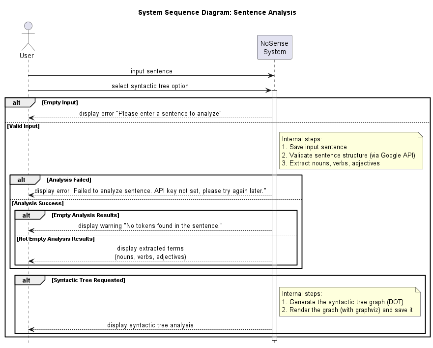
### Template Sentence Generation
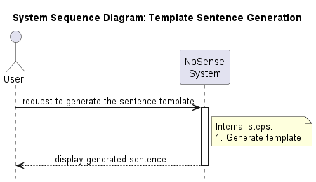
### Sentence Generation
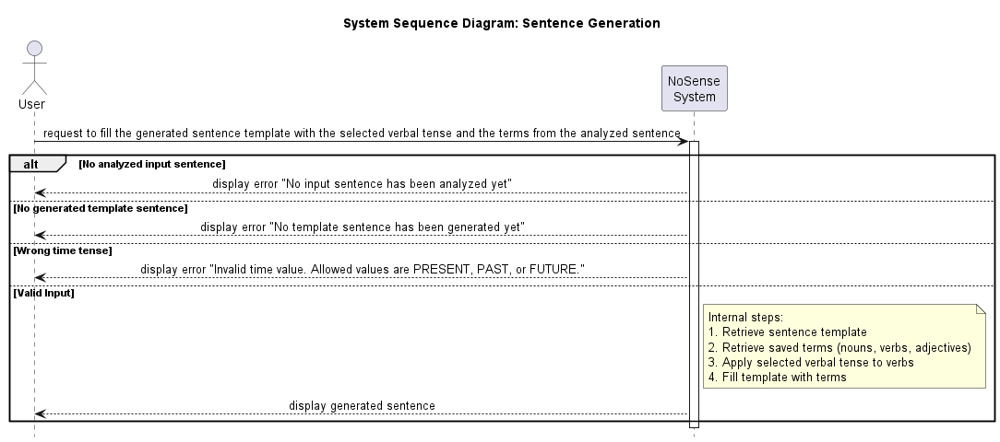
### Terms Storage
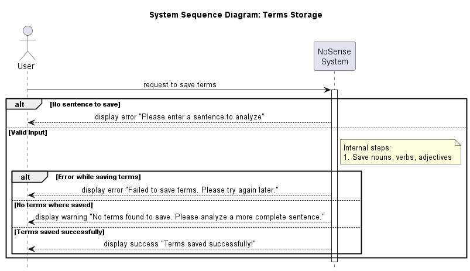
### Toxicity Analysis
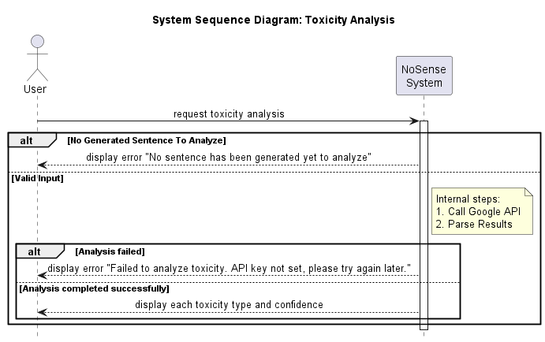
## Design Class Model
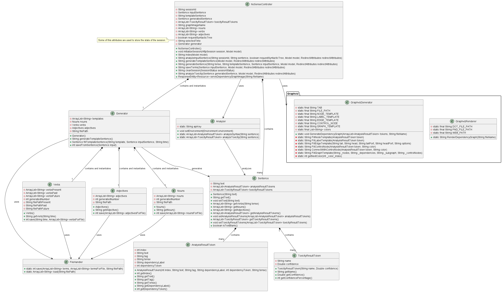
## Internal Sequence Diagrams
### Sentence Analysis
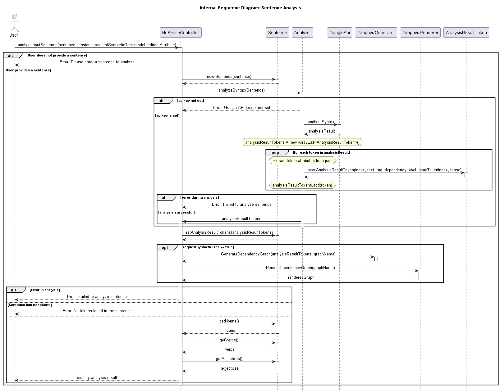
### Template Sentence Generation
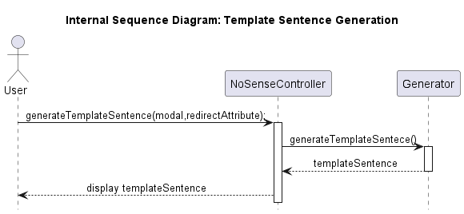
### Sentence Generation
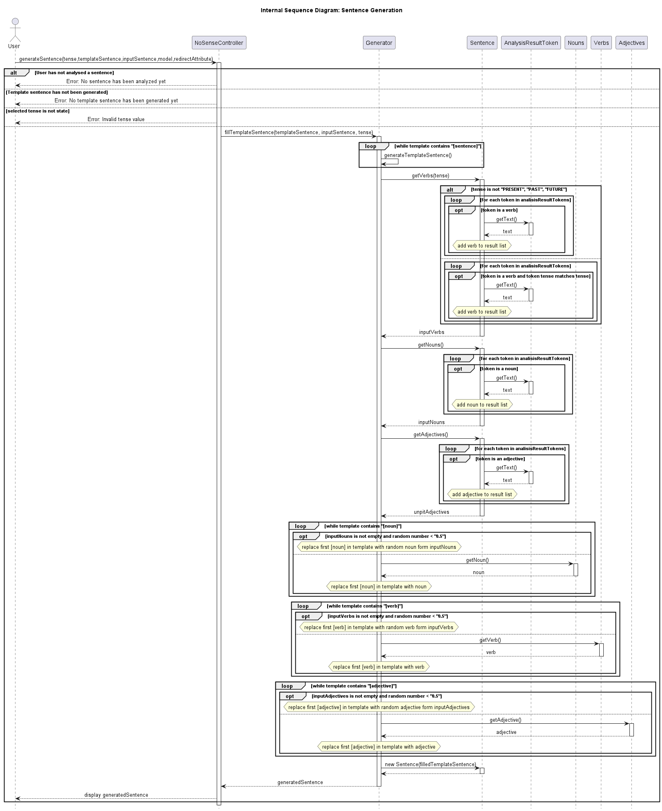
### Terms Storage
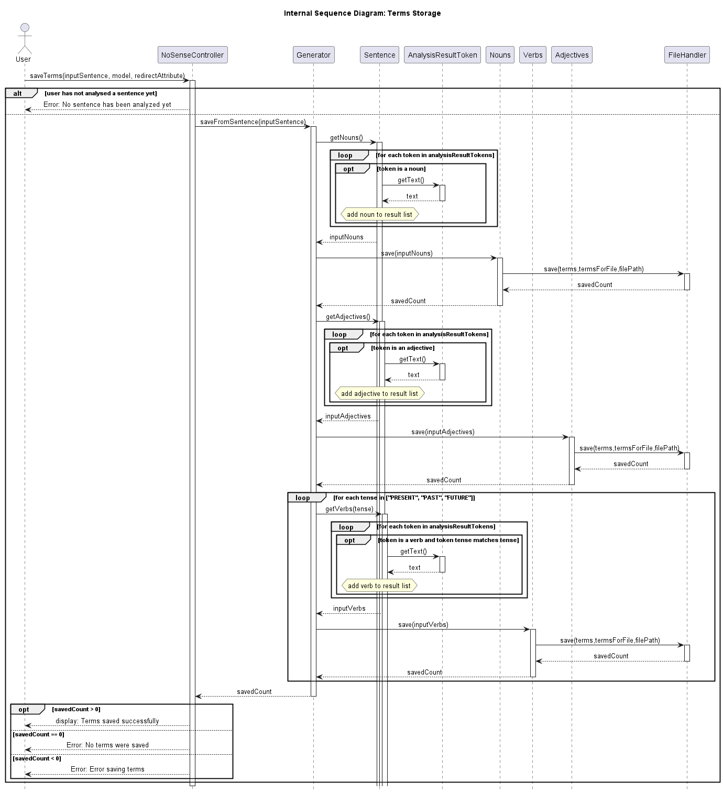
### Toxicity Analysis

